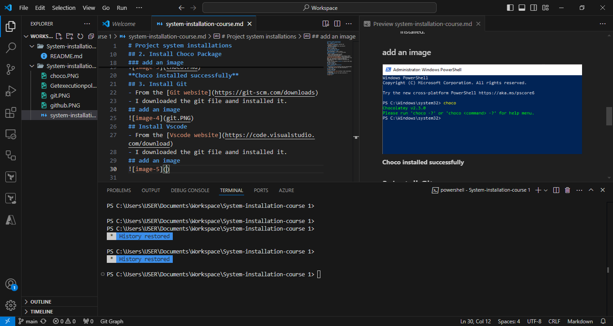

# Project system installations
## 1.  Create a Github Account 
### I logged unto 
- [Github Website](https://github.com)
-Clicked on **SIGNUP**
- Entered my preferred Mail and password
- Set up my Username
### add an image

## 2. Install Choco Package
### Using Powershell.exe
- With PowerShell, i had to ensure **Get-ExecutionPolicy** is not restricted.
### add an image

- then run the following comand
- -Set-ExecutionPolicy Bypass -Scope Process -Force; [System.Net.ServicePointManager]::SecurityProtocol = [System.Net.ServicePointManager]::SecurityProtocol -bor 3072; iex ((New-Object System.Net.WebClient).DownloadString('https://community.chocolatey.org/install.ps1'))
- Then i run the comand **choco** to confirm that choco has been installed.
### add an image

**Choco installed successfully**
## 3. Install Git
- From the [Git website](https://git-scm.com/downloads)
- I downloaded the git file and installed it.
## add an image

## 4. Install Vscode
- From the [Vscode website](https://code.visualstudio.com/download)
- I downloaded the git file and installed it.
## add an image

## 5. Install Vscode extension
- clicked on the extension icon in Vscode and downloaded the vscode extensions as specified.
## add an image

## 6. Install SSH
## Using Powershell.exe
- Run powershell as admin.
- Run the following commands to make sure SSH is available
- [Get-WindowsCapability -Online | Where-Object Name -like 'OpenSSH*']
## add an image

- To give the following command to confirm it has been pre-installed
## add an image

### To start and configure OpenSSH Server for initial use, open an elevated PowerShell prompt (right-click, then select Run as an administrator), then run the following commands to start the sshd service:
### add an image

## 7. Install SSH keys 
## Using the Web Terminal.exe
- To use key-based authentication, you first need to generate public/private key pairs for your client. ssh-keygen.exe is used to generate key files and the algorithms DSA, RSA, ECDSA, or Ed25519 can be specified.
- To generate key files using the Ed25519 algorithm, run the following command from a Web Terminal.exe
- (ssh-keygen -t ed25519)
## add an image

- Using the Enter key to accept the default, or specify a path and/or filename where i would like the keys to be generated. At this point, i was prompted to use a passphrase to encrypt the private key files. The passphrase works with the key file to provide two-factor authentication  to give something like this:
## add an image

- The Public/Private keys both successfully saved in the working directory.
## add an image

## 8. Copy Public keys over to Github
- Having created a Github account earlier
  - Log onto [Github](hhttps://github.com)
  - Click on the Profile icon
  - From the Dropdown>Click on **Settings**
  ## add an image
  
  - Then on the lefthand side menu-bar Clck on **SSH and GPG keys**> Click on **New Key** to add a New key.
  ## add an image
  
## 9. Create a Github Repository
  - From the Homepage> Click on  **New**
  ## add an image
   
  - Enter the Repository name and details to create it.
  ## add an image
  
- Repository created successfully
## add an image

## 10. Clone github repository
- While the repository has been succesfully created, to clone it:
  - Click on the **<> Code** icon
  - ## add an image
  
  - From the Dropdown > click on **SSH** and copy the link associated.
  ## add an image
  
  - In the Vscode Terminal, ensure the current working directory has been **opened in integrated terminal**
  - In the Vscode Terminal,type 'git clone' then paste the copied github repository link.
  ## add an image
  
  ## 11. Push your changes
  - From the working Terminalon Vscode type 'git add .' and 'git commit'
  - And 'git push' to upload the changes